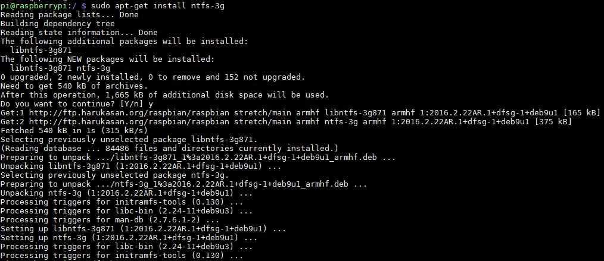

## Raspberry Pi 3b+ 외장하드 마운트 하는 방법

라즈베리파이를 개인 Server로 사용하고자 공유기에 연결하고 포트포워딩 작업을 마무리 했다.
하드 용량은 32G로 Server로 사용하기엔 한참 미치지 못하였기에,
남는 외장하드를 연결하면서 있었던 일들과 절차를 기록해본다.

### 시~~작

우선 외장하드를 ntfs로 포맷하고 라즈베리파이에 연결.
그리고 콘솔에 sudo blkid 입력하면
TYPE="ntfs" 기기가 /dev/sda1로 인식되는걸 확인할 수 있다.
> sudo blkid 

ntfs-3g를 설치한다. 
sudo apt-get install ntfs-3g 입력
> sudo apt-get install ntfs-3g 

근데..에러가 발생한다.
에러 맨 아래에 보니 apt-get을 업데이트를 하라고 나온다.
업데이트를 해보자.
> sudo apt-get update 

업데이트 완료.
다시 ntfs-3g를 설치해보자.
> sudo apt-get install ntfs-3g

성공적으로 설치가 되었다. 

마운트가 잘 되었는지 확인해보자.
> df -h

466G 마운트가 되긴 했는데...위치가 좀 이상하다.

내가 원하는 위치를 잡아줘야 한다.
나의 경우 / 위치에 DATA폴더를 mkdir로 생성했다.
DATA로 마운트를 하기 위한 명령을 입력했다.
> sudo mount /dev/sda1 DATA

이미 마운트가 되어있다고 나왔다.
/etc/fstab을 수정해보자.

> sudo nano /etc/fstab

아래 내용을 추가한다. 간격은 tab이 아닌 space로 띄워줘야 한다.
/dev/sda1     /DATA     ntfs      default     0      0

이제 재부팅을 하고 마운트가 잘 되었나 확인해 보면!

마운트 성공.

